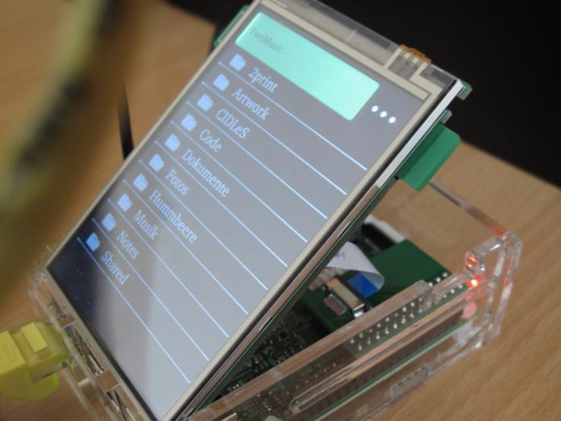

.. Die Brummbeere documentation master file, created by
   sphinx-quickstart on Mon Apr 27 16:13:30 2015.
   You can adapt this file completely to your liking, but it should at least
   contain the root `toctree` directive.

Die Brummbeere
==============

ownCloud Music Player
---------------------

Die Brummbeere is an ownCloud audio player based on the Qt framework. The
application was written for embedded systems in mind, so it features a very
simplistic user interface suitable for low resolutions and optimized for lo
energy consumption. It still runs on Linux and Mac.

`View on GitHub <https://github.com/pbouda/brummbeere>`_ || `Download .zip
<https://github.com/pbouda/brummbeere/zipball/master>`_

Die Brummbeere source code is distributed under the GNU GENERAL PUBLIC LICENSE
Version 2.

Die Brummbeere documentation is Public Domain.

Contents
--------

.. toctree::
   :maxdepth: 2

   compiling
   raspi
   feedback

Indices and tables
==================

* :ref:`genindex`
* :ref:`modindex`
* :ref:`search`

