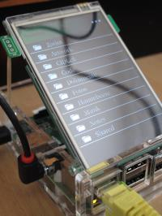

Embedded Brummbeere on the Raspberry
====================================

This tutorial shows how to build a custom embedded Linux for the Raspberry
that runs Die Brummbeere to play audio files from ownCloud. The system will
boot a minimal Linux environemnt with Qt libraries and automatically start
Die Brummbeere. Optionally, it will load drivers for touchscreens and/or audio
boards. We use the Qt Multimedia module and the Linux ALSA sound environment to
play back the files. This setup can be used to run any other Qt apps on the
Raspberry, of course. It is a general guide how to boot a minimal system with
the latest Qt library, including support for touchscreens, OpenGL and
multimedia.

At the moment, this guide is for the Raspberry Pi 2 and Raspberry A/B(+). You
need to run Linux to compile your own embedded Linux with `buildroot
<http://buildroot.net>`_.

As an example for a touchscreen we will use the Tontec 3,5" TFT. It comes with
a nice case that you can see on the picture above. The TFT is `available on
Amazon <http://www.amazon.de/gp/product/B00R13OAZ0/ref=as_li_tl?ie=UTF8&camp=1638&creative=6742&creativeASIN=B00R13OAZ0&linkCode=as2&tag=jsusde-21&linkId=VUAEOOODS63AMKTM>`_,
for example. It is easily connected to the Raspberry GPIO header and its drivers
are part of the Raspberry Linux distribution.

.. _prepare_sd_card:

Prepare SD card
---------------

The SD card has to co be prepared with a certain partition layout in order
to be bootable on the Raspberry. The standard layout is a small FAT partition
and a larger ext4 partition in this order. The easiest way to get prepare the
card in this way is to install a standard Raspbian on the card. You can
find information about the process on the Raspberry download page:

https://www.raspberrypi.org/downloads/

Just follow the instructions given on the page under the ``Raspbian`` heading.

Optional: Use latest device tree overlays
.........................................

The latest Raspberry kernels and images support `device tree overlays
<https://www.raspberrypi.org/documentation/configuration/device-tree.md>`_ (DTO)
for specific hardware like TFT display with touch or audio card. The usage
of device trees makes support for different hardware easier, compared to
the configuration of device drivers via kernel modules. If you plan to use
a TFT touch screen (like the Tontec TFT) or an audio card (like Hifiberry)
you can enable the device trees for your hardware. The following example
enables the Tontec TFT with touch support and sets the correct default
resolution. As we will use the `EGLFS backend of Qt
<http://doc.qt.io/qt-5/embedded-linux.html>`_, we have to turn on HDMI
even if no screen is connected. The embedded system then uses `fbcp
<https://github.com/tasanakorn/rpi-fbcp>`_ to copy the current HDMI output to
the framebuffer of the TFT screen.

First we will update the DTOs of the Raspbian boot partition that was installed
in the previous step. Mount the partitions of your SD card and check that you
have a folder ``overlays``. We will replace it with the current firmware
overlays in the Raspberry GitHub repository. Download and unpack the firmware:

.. code-block:: sh

   $ wget https://github.com/raspberrypi/firmware/archive/master.zip
   $ unzip master.zip

In the folder ``firmware-master`` you will find the folder ``boot``, which
contains the latest firmwares, kernels and overlays. You can just copy the
full content of the ``boot`` folder to the boot partition of your SD card.
Choose to overwrite any existing files on the card. The buildroot system
will later overwrite the kernel of the boot partition with a self-compiled
version, the rest of the boot partition will stay as it is now.

Optional: Modify config.txt for hardware support
................................................

Next, we will enable the Tontec TFT touchscreen and set the correct resolution.
Open the file ``config.txt`` on the boot partition of you SD card and paste
the following content::

   dtoverlay=mz61581,rotate=0

   hdmi_cvt=320 480 50 2
   hdmi_group=2
   hdmi_mode=87
   hdmi_force_hotplug=1

The first line enables the device tree overlay for the TFT, including touch
support. The output is not rotated, so we get portrait mode.

The next 4 lines set a custom resolution (we need 320x480 pixels for the
Tontec screen) and force HDMI hotplug. We need the latter as we want to run
without any external display on HDMI, but still need HDMI enabled to get OpenGL
support in Qt and a framebuffer to copy the graphics output to the TFT's
framebuffer.

Build Embedded Linux with Die Brummbeere
----------------------------------------

In this step we will build a complete Linux system including the kernel, drivers
and the Qt libraries. The build process depends on buildroot.

Buildroot configuration
.......................

First you need to download Die Brummbeere and buildroot. The Raspberry 2 is only
supported in the current buildroot git repository, so we clone the current
buildroot master. The Brummbeere repository contains a skeleton folder ``raspi``
that we use to clone into. This folder contains scripts and files that buildroot
will use to build the filesystem for the embedded system:

.. code-block:: sh

   $ git clone https://github.com/pbouda/brummbeere.git
   $ cd brummbeere/raspi
   $ git clone git://git.buildroot.net/buildroot

In the next step we configure buildroot for the Raspberry Pi 2 and a complete
Qt framework with dependencies like ALSA. The folder ``raspi/buidroot-config``
contains  buildroot configuration files to set all options that we need. Enter
the ``buildroot`` folder and load the configuration:

.. code-block:: sh

   $ cd buildroot
   $ make defconfig BR2_DEFCONFIG=../buildroot-config/brummbeere-raspi2.config

If you want to build Die Brummbeere for Raspberry A/B(+) then choose the "raspi"
configuration file during this step:

.. code-block:: sh

   $ cd buildroot
   $ make defconfig BR2_DEFCONFIG=../buildroot-config/brummbeer-raspi.config

Adding NTP daemon
.................

As the Raspberry does not have a realtime clock, our embedded system start an
NTP daemon to set the current date and time. Qt will use the date to validate
the SSL certificate of your ownCloud server, if the connection is encrypted.
As the embedded system uses buildroot's busybox, we will just add the ``ntpd``
option to the configuration. Start the menu configuration of busybox:

.. code-block:: sh

   $ make busybox-menuconfig

In the menu choose the option ``Networking Utilities -> ntpd``. Exit and save.

Download Raspberry tools
........................

To be able to add support for device tree overlays in a later step we need
to download the Raspberry tools. The tools contain a script ``mkknlimg`` that
adds a trailer to the self-compiled kernel. It also includes a script
``knlinfo`` that output whether a given kernel contains the trailer for DTO
support. You can just clone the tools from GitHub. The script that installs
the root filesystem later expects the script to be located in
``brummbeere/raspi/tools/mkimage``, so make sure that you clone into the folder
``brummbeere/raspi``:

.. code-block:: sh

   $ cd ..
   $ git clone https://github.com/raspberrypi/tools.git

Modify installrootfs.sh script
..............................

The script that install the root filesystems needs to know the device of
your SD card. Please check carefully which device your SD card uses and
adapt the script in ``raspi/scripts/installrootfs.sh``. Currently the device
for the SD card is ``/dev/sdc``. Change those device names to your setup
**in all locations**.

If your SD card is still mounted from step :ref:`prepare_sd_card` you might
just call ``mount`` to see a list of all filesystems. Find your SD card in this
list and use the device names that are listed (like ``/dev/sdc1`` and
``/dev/sdc2``).

**Careful: Your SD card has to prepared with the two Raspberry partitions and
should be mounted for the following steps. If you do not edit the script
``installrootfs.sh`` with the correct device names your hard disk might be
formatted!**

Add config file for ownCloud
............................

As the current version of Die Brummbeere does not contain an onscreen keyboard,
you might not be able to edit the URL, user name and password on the Raspberry.
To set an initial configuration you can create a file ``Brummbeere.conf`` in the
folder ``raspi/userland/target``. The file has the following content::

   url=https://yourownclouddomain.com
   user=yourusername
   password=yourpassword

The file will be copied to the correct location on the root filesystem
automatically and will be used to access your ownCloud.

Start the build process
.......................

You can now start the build process. This will create Linux, all libraries
and copy everything to the SD card. If you do not run with root privileges
the build process will ask for a root password at some later point (when the
filesystem is copied to the SD card). The whole procedure might take a while,
up to a few hours. Just run:

.. code-block:: sh

   $ make

Good luck and have fun with Die Brummbeere!
